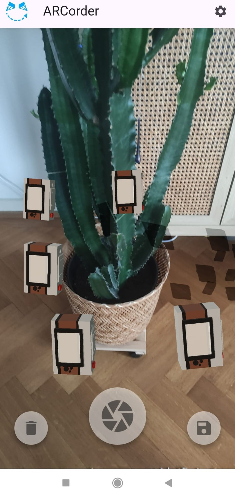

Very simple app written in flutter to record and save camera trajectories using AR Core.

## Installation & Usage

Download the latest version for the release section and install the app in your device.

Take a few shots and click save. The recordings will be saved to `/storage/emulated/0/ARCorder`.

The images and trajectories are saved in [Nerfstudio format](https://docs.nerf.studio/quickstart/data_conventions.html#dataset-format).

## Development

* The app is written in Flutter and has only been tested on Android devices. 
* It requires to download a [custom fork](https://github.com/serizba/ar_flutter_plugin) of the `ar_flutter_plugin_flutterflow`. It should be automatically downloaded with `flutter pub get`.
* Install flutter ([guide](https://docs.flutter.dev/get-started/install)).
* To install dependencies run `flutter pub get`.
* To run in attached device run `flutter run [device]`.
* To build the APK run `flutter build apk --release`.

To-Do list:

- [ ] Adapt `ar_flutter_plugin_flutterflow` iOS code to also return intrinsics and clean images.
- [ ] Use the `ar_flutter_plugin_2`.
- [ ] Refactor code
- [ ] Continuous recording (video sampling every second or so).

## Acknowledgements

This app uses a [custom fork](https://github.com/serizba/ar_flutter_plugin) of the original [ar_flutter_plugin_flutterflow](https://github.com/hlefe/ar_flutter_plugin_flutterflow) that allows to return intrinsics and to take snapshots without rendered models. I appreciate the effort of [@hlefe](https://github.com/hlefe) for creating such a plugin, and I keep an eye on the [ar_flutter_plugin_2](https://github.com/hlefe/ar_flutter_plugin_2).

The 3D camera object used in the app is a model from Gabriel Valdivia. Model available [here](https://poly.pizza/m/eAoNPV5bfmK).